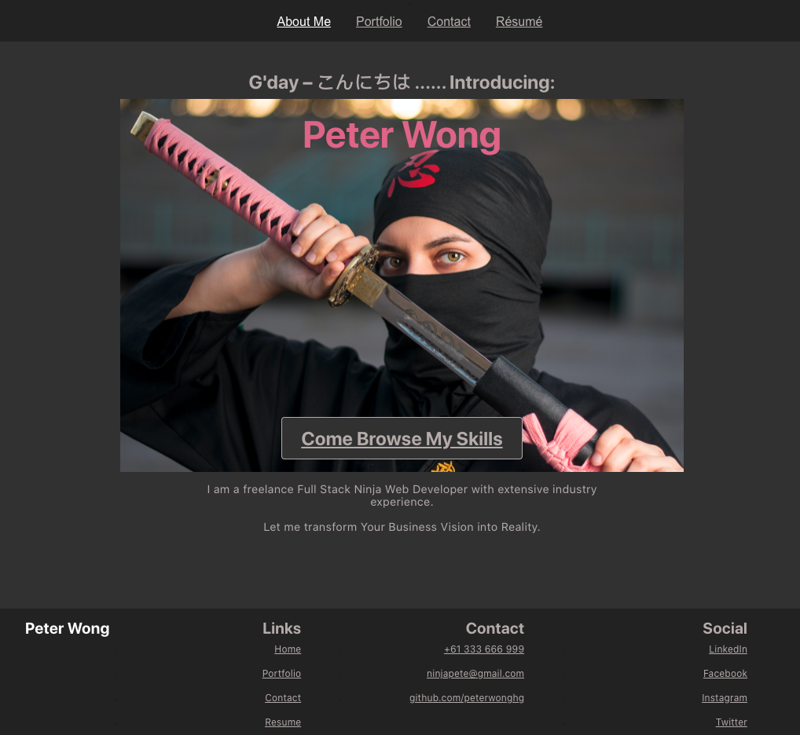

# C20reactportfolio


GitHub: https://github.com/peterwonghg/c20reactportfolio.git

URL: https://peterwonghg.github.io/c20reactportfolio/

## Table of Contents:
### - [Description](#description)
### - [Usage](#usage)
### - [License](#license)
### - [Contributing](#contributing)
### - [Questions](#questions)
### - [References](#references)
<br><br>

## Description
```md
AS AN employer looking for candidates with experience building single-page applications
I WANT to view a potential employee's deployed React portfolio of work samples
SO THAT I can assess whether they're a good candidate for an open position
```

## Usage
```md
GIVEN a single-page application portfolio for a web developer
WHEN I load the portfolio
THEN I am presented with a page containing a header, a section for content, and a footer
```


```md
WHEN I view the header
THEN I am presented with the developer's name and navigation with titles corresponding to different sections of the portfolio
WHEN I view the navigation titles
THEN I am presented with the titles About Me, Portfolio, Contact, and Resume, and the title corresponding to the current section is highlighted
WHEN I click on a navigation title
THEN I am presented with the corresponding section below the navigation without the page reloading and that title is highlighted
WHEN I load the portfolio the first time
THEN the About Me title and section are selected by default
WHEN I am presented with the About Me section
THEN I see a recent photo or avatar of the developer and a short bio about them
```


```md
WHEN I am presented with the Portfolio section
THEN I see titled images of six of the developer’s applications with links to both the deployed applications and the corresponding GitHub repositories
```


```md
WHEN I am presented with the Contact section
THEN I see a contact form with fields for a name, an email address, and a message
```


```md
WHEN I move my cursor out of one of the form fields without entering text
THEN I receive a notification that this field is required
```


```md
WHEN I enter text into the email address field
THEN I receive a notification if I have entered an invalid email address
```


```md
WHEN I am presented with the Resume section
THEN I see a link to a downloadable resume and a list of the developer’s proficiencies
```


```md
WHEN I view the footer
THEN I am presented with text or icon links to the developer’s GitHub and LinkedIn profiles, and their profile on a third platform (Stack Overflow, Twitter)
```


## License
- MIT

## Contributing
Thank you for investing your time in contributing to my Portfolio!<br><br>
In this guide you will get an overview of the contribution workflow from creating a pull request, reviewing and merging the pull request.<br><br>
<b>Making the changes locally</b><br>
1. Fork the repository<br>
2. Install or update Node.js 8.2.4<br>
3. Create a working branch and start with your changes!<br><br>
<b>Commit your update</b><br>
Commit the changes once you are happy with them.  Don't forget to self-review to speed up the review process.<br><br>
<b>Pull Request</b><br>
When you are finished with the changes, create a pull request<br><br>
<b>Merging your Pull Request</b><br>
1. Our team will review your Pull Request.<br>
2. We may ask for changes to be made before your Pull Request can be merged.<br>
3. You can apply suggested changes directly through the UI.  You can make any other changes on your fork, then commit them on your branch.<br>
4. As you update your PR and apply changes, mark each conversation as resolved.<br>
5. You can then merge your contributions.<br><br>
Thank you for your contribution.<br><br>

## Questions
If you have any questions, please contact me:
- GitHub: [peterwonghg](https://github.com/peterwonghg)
- Email: peterwonghg@gmail.com

## References
React Router Tutorial | React for Beginners
https://www.youtube.com/watch?v=Law7wfdg_ls

Learn React Router v6 in 45 minutes
https://www.youtube.com/watch?v=Ul3y1LXxzdU

React Project Tutorial – Build a Portfolio Website w/ Advanced Animations
https://www.youtube.com/watch?v=bmpI252DmiI

Gentleman Image
https://www.freepik.com/free-photo/young-bearded-man-with-striped-shirt_9660042.htm#query=man&position=0&from_view=keyword&track=sph

NoteTaker Image
Photo by Kelly Sikkema on Unsplash

Text Editor Image
Photo by Max Chen on Unsplash

KidsHub Image
Photo by Marisa Howenstine on Unsplash

Work Scheduler Image
Photo by Firmbee.com on Unsplash

Computer Code Image
Photo by Glenn Carstens-Peters on Unsplash

Laptop Image
Photo by Amy Hirschi on Unsplash

Safety Helmets Image
Photo by Pop & Zebra on Unsplash

Weather Image
Photo by Osman Rana on Unsplash

Quiz
Photo by Olav Ahrens Røtne on Unsplash

#01 Complete React Portfolio Website Project | NavMenu – WEB CIFAR
https://www.youtube.com/watch?v=w8NSgfHfLug

#02 Complete React Portfolio Website Project | Home (Hero Section) – WEB CIFAR
https://www.youtube.com/watch?v=bJN34yW4lBI

09 Projects Page
https://www.youtube.com/watch?v=DJtGSBD8ROE

#10 Complete React Portfolio Website Project | Contact Page – WEB CIFAR
https://www.youtube.com/watch?v=BtdM2_likL8

08 About Page
https://www.youtube.com/watch?v=SRgdV6QIyU8

#07 Complete React Portfolio Website Project | Footer – WEB CIFAR
https://www.youtube.com/watch?v=sbFh6WhIOu0


<br><br>